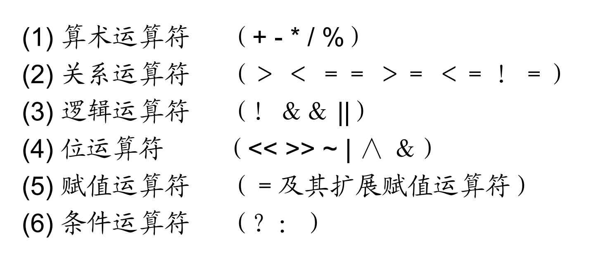
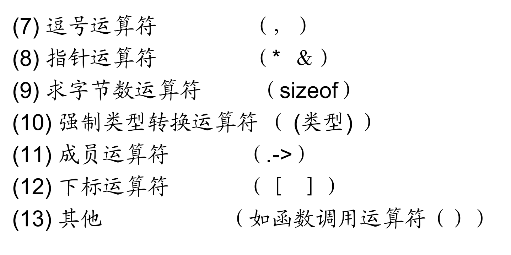
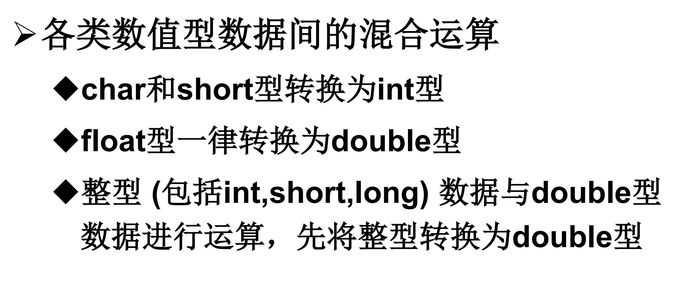
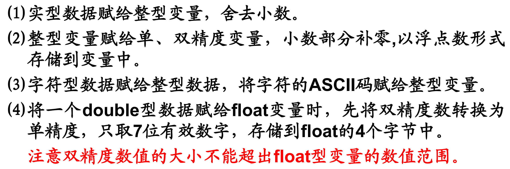
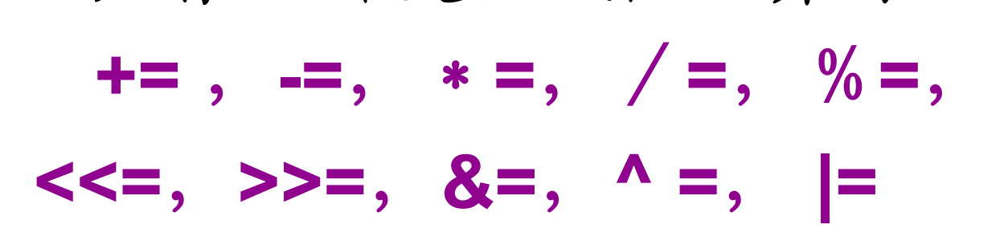
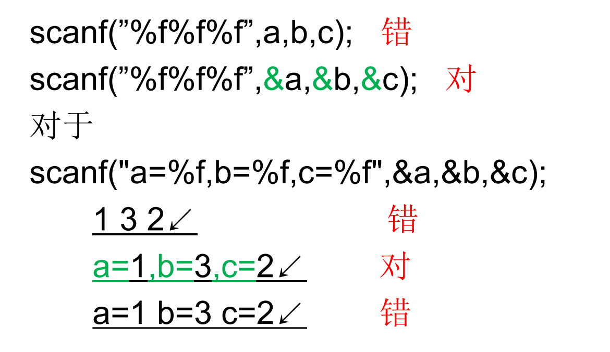
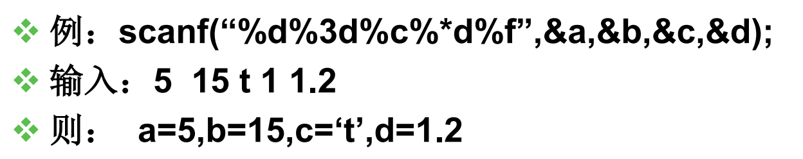

# 问题

## 1. int main 和 void main
main 函数：是程序的入口，C语言执行程序的时候，会先找main函数

根据编译器的不同，老git add 笔记.md旧版本的编译器会采用void main

# 语法

## 1. printf

在这里，**%f** 为占位符，默认精度为小数点后六位

## 2. 占位符
%d为正数占位符，对应int和short类

%f为浮点占位符，对应float和double类

## 3. 算术运算符
### 3.1 基本运算符
- +加

- -减

- *乘

- / 除：两边都是整数，结果必然是整数；只要有一边是小数，结果才是小数

% 取余

### 3.2 运算符优先级
**（）> % * / > +-**

## 4 字符型数据
### 4.1 字符常量
- 字符常量是用 **单撇号** 括起来的常量或 **转义字符**


如 'A' 输出65，因为A在ASCII码中为65

### 4.2 字符变量
用char定义字符变量，在内存中占一个字节

```c
char c = '?' 

printf("%d %c\n",c,c)
```

则以上代码的输出为63 ？

内存中，c的表示方式为[0000 0000 0011 1111]  
- char 变量里存储的是 ASCII 码值
- 执行 *%d* 的时候，会输出**ASCII码值，是一个数字**  
- 执行 *%c* 的时候，会输出**ASCII码对应的字符，是一个字符**

## 5 整型数据
### 5.1 整型数据的分类
- 基本整型 **int** 型
- 短整型 **short int** 型
- 长整型 **long int** 型
### 5.2 整型常量
- 整型常量是不带小数点的数值

### 5.3 整形变量
- 整形变量占4个字节

## 6 实型数据（浮点型）
### 6.1 实型变量的分类
- 单精度实型变量（float型）：编译的时候分配4个字节
- 双精度实型变量（double型）：编译的时候分配8个字节
- 长双精度实型变量（long double型）
### 6.2 实型常量
- 十进制小数形式：必须有小数点
- 指数形式：e前e后必有数，e后必为整数

## 7 运算符和表达式



### 7.1 算术运算符
加减乘除求余

* 自增自减运算符

**i++** ：先使用i，然后在i的基础上加1

**i--** ：先使用i，然后在i的基础上减1

**++i** ：先使i的值加1，再使用i

**--i** ：先使i的值减1，再使用i

自增自减运算符只能用于整型变量，不能用于常量或者表达式

### 7.2 算术表达式


- 强制类型转换：(类型名)(表达式)

### 7.3 赋值运算符
- 赋值运算符 = 

赋值运算符要求等号两边 **类型一致**，当类型不一致的时候需要进行强制转换


- 复合赋值运算符：在=号前面加上其他运算符


### 7.4 赋值表达式
- 求解过程：求赋值运算符右侧表达式的值，赋给左侧的变量

### 7.5 逗号运算符
逗号运算符的优先级在所有运算符中是最低的

## 8 输入输出函数
### 8.1 输出函数printf

- 语法： printf(格式声明，输出表列)

输出表列的位置可以是常量、变量或者表达式

- 格式字符：

%d 输出int型

% c输出一个字符

%s 用来输出字符串

%f 用小数的形式输出实数

```
%-m.nf
```

用来控制浮点数的精度

-是左对齐的标志：左对齐和右对齐的区别在于，当内容比字段宽度短的时候，空格放在哪边

字段宽度m： 表示整个输出占多少字符的位置

精度n： 表示小数点后字符串的长度

```
// 右对齐（默认）：空格在左边，数字靠右
printf("[%10.2f]\n", num);
// 输出: [      3.14]
```
```
// 左对齐（加-）：空格在右边，数字靠左  
printf("[%-10.2f]\n", num);
// 输出: [3.14      ]
```
%e e格式符以指数形式输出字符

指数部分占5列，小数点前必须有且仅有1位数字
```
printf(”%e”,123.456);
```

输出1.234560 e+002

%m.ne
```
printf(”%13.2e”,123.456)
```
输出： 1.23e+002 (前面有4个空格)

### 8.2 输入函数scanf
```
scanf(格式声明,地址表列)
```



- scanf的宽度限制和赋值抑制符
```
%[*][输入数据宽度][长度]类型
```
*赋值抑制符：
%*d 会消耗输入的数据，不消耗参数列表中的变量

```
int a, d;
scanf("%d%*d%d", &a, &d);

输入流：10  20  30
        ↓   ↓   ↓
       %d  %*d  %d
        ↓   ↓   ↓
       a=10 丢弃 d=30
```


### 8.3 putchar函数
从计算机向显示器输入字符